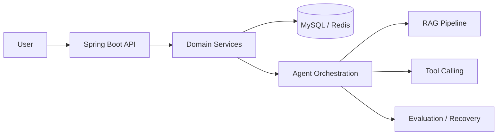

  

<h2 align="center">Java Backend Developer · AI Agent Builder · Systems Learner</h2>

  I build backend systems, RAG applications, and agent-based tools with a focus on clear architecture,
  observable workflows, and pragmatic engineering tradeoffs.

  <a href="https://github.com/weiqiang612/Personal-CRM-Intelligent-Contact-Management-Platform">Personal CRM</a> ·
  <a href="https://github.com/weiqiang612/sky-take-out">Sky Take Out</a> ·
  <a href="https://github.com/weiqiang612/project-sky-admin-vue-ts">Admin Web</a> ·
  <a href="https://github.com/weiqiang612/Ethan_Notes">Engineering Notes</a>

  
  
  
  
  
  

## Engineering Focus

- Backend architecture with Java, Spring Boot, MySQL, Redis, and domain-oriented API design
- AI Agent and RAG systems with retrieval pipelines, tool calling, workflow state, and evaluation
- Reliability concerns such as transaction boundaries, concurrency control, caching strategy, and failure recovery
- Developer productivity through documentation-driven development, automation, and Codex-assisted workflows

## Technical Stack

| Area | Tools |
| --- | --- |
| Backend | Java, Spring Boot, MyBatis, MyBatis-Plus, REST APIs, JWT |
| Data | MySQL, Redis, Elasticsearch |
| AI / Agent | RAG, Tool Calling, Workflow Orchestration, OpenAI-compatible APIs |
| Frontend | Vue 3, Vite, TypeScript, Pinia, Element Plus, ECharts |
| Infrastructure | Docker Compose, Linux, Nginx, GitHub Actions |
| Engineering | TDD, Code Review, System Design, Documentation |

## Selected Projects

| Project | Focus | Stack |
| --- | --- | --- |
| [Personal CRM Intelligent Contact Management Platform](https://github.com/weiqiang612/Personal-CRM-Intelligent-Contact-Management-Platform) | Contact lifecycle management, reminders, activity timeline, dashboard, avatar upload, and Contact Agent workflows. Public demo: `crm.weiqiang.me` | Spring Boot 3.5, Java 17, MyBatis-Plus, MySQL 8, Redis, Vue 3, TypeScript, Docker Compose, Nginx |
| [Sky Take Out](https://github.com/weiqiang612/sky-take-out) | Backend practice project around ordering, store operations, and service-layer business flows | Java, Spring Boot, MySQL, Redis |
| [Project Sky Admin Vue TS](https://github.com/weiqiang612/project-sky-admin-vue-ts) | Admin frontend for operational workflows and management screens | Vue, TypeScript |
| [Ethan Notes](https://github.com/weiqiang612/Ethan_Notes) | Structured backend notes for Java, MySQL, Redis, system design, and interview review | Markdown, Obsidian |
| [Bagu Basecamp](https://github.com/weiqiang612/bagu-basecamp) | Study workflow and review base for backend fundamentals and AI-assisted preparation | Next.js, Markdown |

## System Thinking

## Engineering Notes

I keep learning notes and implementation experiments around:

- Java concurrency, JVM fundamentals, and backend design patterns
- MySQL indexing, transactions, isolation levels, and query optimization
- Redis caching, expiration, consistency, and high-frequency interview topics
- RAG architecture, AI Agent execution safety, state tracking, and evaluation

## Principles

- Prefer explicit state over hidden control flow
- Design APIs around domain behavior, not only database tables
- Treat AI agents as systems with uncertain outputs and observable failure states
- Keep documentation close to implementation
- Optimize for maintainability before cleverness

  
  

