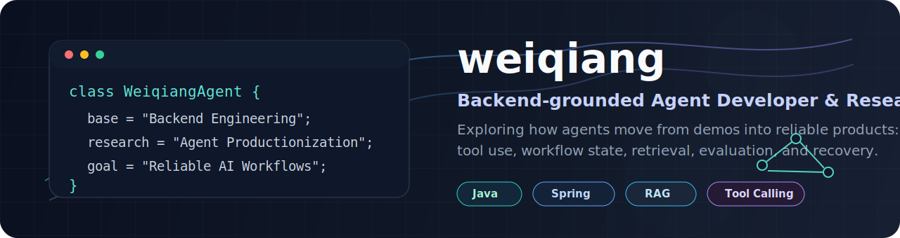
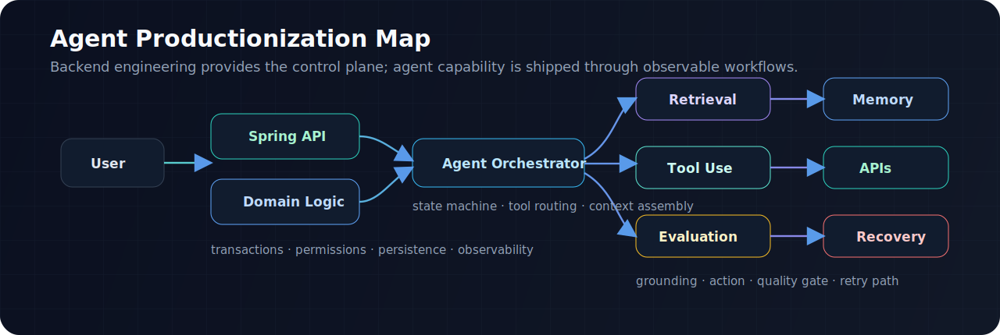

  

<h2 align="center">weiqiang · 有后端工程能力的 Agent 开发者与研究者</h2>

  <a href="./README.md">English</a> ·
  <a href="./README.zh-CN.md"><strong>简体中文</strong></a>

  围墙，关注那些需要被跨越的围墙。

  我关注的不是只停留在 prompt demo 的 Agent，而是有真实后端工程支撑的 Agent 系统：
  清晰的领域边界、可持久化的工作流状态、可靠的工具调用、检索增强、评估与失败恢复。

  正在探索 AI Agent 如何从 demo 走向可落地的生产级应用，也会分享一些有趣、实用的 Agent 使用技巧。

  <a href="https://github.com/weiqiang612/Personal-CRM-Intelligent-Contact-Management-Platform">Personal CRM</a> ·
  <a href="https://github.com/weiqiang612/Ethan_Notes">Engineering Notes</a> ·
  <a href="https://github.com/weiqiang612/skillport">Skillport</a> ·
  <a href="https://github.com/weiqiang612/dev-standards">Dev Standards</a>

  
  
  
  
  
  

## 为什么叫「围墙」？

选择这个名字，并不是为了筑起围墙。

相反，它提醒我：每个时代都会出现新的围墙。它可能来自技术、知识，也可能来自信息的不对称。

我相信，真正有价值的技术，不应该成为少数人的特权，而应该帮助更多普通人跨越这些门槛。

**围墙，关注那些需要被跨越的围墙。**

## 我正在构建的方向

我希望 `weiqiang` 这个品牌表达的是一个清晰方向：**有后端工程能力的 Agent 开发者与研究者**。

我目前主要在探索 Agent 落地，而不是只做 prompt demo：

- 如何把 Agent 工作流设计成显式、可恢复、可审计的状态流转
- 如何让工具调用具备权限校验、用户确认、失败重试和操作留痕
- 如何把 RAG 和真实业务数据、文档、用户意图连接起来
- 如何评估 Agent 是否真的完成了任务，而不只是生成了一段看起来合理的回答
- 如何把 Agent 能力嵌入 CRM、后台管理、自动化流程这类真实产品场景
- 如何把有趣、实用的 Agent 使用技巧整理成普通开发者也能快速理解和复用的内容

## 工程基础

| 方向 | 关注点 |
| --- | --- |
| 后端 | Java, Spring Boot, MyBatis / MyBatis-Plus, REST APIs, JWT, 面向领域的服务设计 |
| 数据 | MySQL 事务与索引、Redis 缓存与一致性、Elasticsearch 基础 |
| Agent / AI | RAG, Tool Calling, 工作流编排, 上下文组装, 评估, OpenAI-compatible APIs |
| 前端 | Vue 3, Vite, TypeScript, Pinia, Element Plus, ECharts |
| 部署 | Docker Compose, Linux, Nginx, 环境配置, 公网演示部署 |
| 实践 | 文档驱动开发、代码审查、测试规划、系统设计笔记 |

## 主线方向

| 项目 | 定位 |
| --- | --- |
| [Personal CRM Intelligent Contact Management Platform](https://github.com/weiqiang612/Personal-CRM-Intelligent-Contact-Management-Platform) | 我的主要全栈产品和 Agent 落地实践。项目包含联系人管理、事项提醒、活动轨迹、数据看板、部署上线，以及支持查询和确认式写操作的 Contact Agent。公网演示：`crm.weiqiang.me` |
| [Ethan Notes](https://github.com/weiqiang612/Ethan_Notes) | 长期维护的工程知识库，覆盖 Java、MySQL、Redis、系统设计、Agent 学习笔记，也会沉淀有趣、实用的 Agent 使用技巧 |
| [Bagu Basecamp](https://github.com/weiqiang612/bagu-basecamp) | 用于后端基础复习和 AI 辅助学习流程的结构化复习基地 |

## 练习项目

Sky 系列是练习项目，主要用于补齐后端业务流、管理端前端、小程序端等工程基础；它们不是我当前主推的 Agent 方向。

| 系列 | 仓库 | 练习内容 |
| --- | --- | --- |
| Sky Take Out | [后端](https://github.com/weiqiang612/sky-take-out) · [管理端](https://github.com/weiqiang612/project-sky-admin-vue-ts) · [小程序](https://github.com/weiqiang612/sky-take-out-mini-program) | 外卖业务流、店铺运营、管理端 UI、小程序流程、MySQL、Redis 与前后端协作 |

## Agent 落地架构图

  

## 正在研究的问题

- Agent 应该如何记住状态，同时不隐藏关键控制流？
- 权限校验、用户确认和回滚路径应该放在哪一层？
- RAG 如何面向真实业务任务评估，而不是停留在通用问答？
- 哪些逻辑应该留在确定性的后端代码里，哪些能力适合交给模型？
- 如何让 Agent 行为具备足够的可观测性，方便调试、复盘和审查？

## 工程原则

- 后端系统是控制平面，Agent 是系统中的一种能力
- 相比隐式 prompt 行为，更偏好显式状态、类型化契约和操作审计
- 把工具调用当成生产工作流处理：权限、校验、确认和恢复都不能缺席
- 让文档贴近实现，保证设计决策可以被追踪和检查
- 先构建小而可用的闭环，再逐步扩大 Agent 的操作权限
